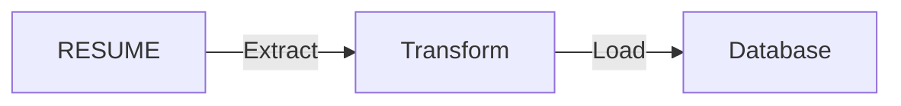

## Project design



We pull data from RESUME, transform them using python and load them into a database.

## Prerequisites

1. [Python3](https://www.python.org/downloads/)
2. [sqlite3](https://www.sqlite.org/download.html) (comes preinstalled on most os)

```

Run the following commands are to be run via the terminal, from your project root directory.

```bash
python3 -m venv venv # Create a venv
. venv/bin/activate # activate venv
pip install -r requirements.txt # install requirements
make ci # Run tests, check linting, & format code
make reset-db # Creates DB schemas
make parse # parse the resume
```

```sqlite
select * from resume limit 1;
.exit
```


## Make commands

We have some make commands to make things run better, please refer to the [Makefile](./Makefile) to see them.